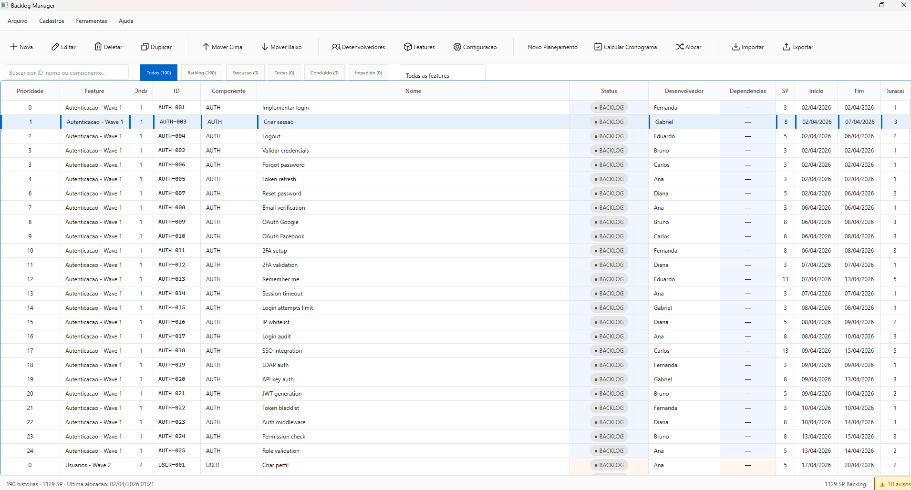

# Zion Backlog Manager

[](https://github.com/tuyoshivinicius/zion-backlog-manager/actions/workflows/ci.yml)
[](https://codecov.io/github/tuyoshivinicius/zion-backlog-manager)
[](https://sonarcloud.io/summary/new_code?id=tuyoshivinicius_backlog_manager_v2)
[](https://sonarcloud.io/summary/new_code?id=tuyoshivinicius_backlog_manager_v2)
[](https://sonarcloud.io/summary/new_code?id=tuyoshivinicius_backlog_manager_v2)
[](https://sonarcloud.io/summary/new_code?id=tuyoshivinicius_backlog_manager_v2)
[](https://pypi.org/project/zion-backlog-manager/)
[](https://pypi.org/project/zion-backlog-manager/)
[](https://pypi.org/project/zion-backlog-manager/)
[](https://github.com/tuyoshivinicius/zion-backlog-manager/blob/main/LICENSE)

Gerenciador de backlog desktop com alocacao automatica de desenvolvedores, construido com PySide6 e Clean Architecture.

---

## Indice

- [Sobre o Projeto](#sobre-o-projeto)
- [Conceito e Filosofia](#conceito-e-filosofia)
- [Funcionalidades](#funcionalidades)
- [Aplicabilidade](#aplicabilidade)
- [Screenshot](#screenshot)
- [Stack Tecnologica](#stack-tecnologica)
- [Arquitetura](#arquitetura)
- [Instalacao](#instalacao)
- [Uso](#uso)
- [Solucao de Problemas](#solucao-de-problemas)
- [Contribuicao](#contribuicao)
- [Licenca](#licenca)

---

## Sobre o Projeto

O **Zion Backlog Manager** e uma aplicacao desktop para gestao de backlogs de desenvolvimento de software. Ele resolve o problema de equipes que precisam organizar, priorizar e alocar stories a desenvolvedores de forma eficiente, eliminando planilhas manuais e processos fragmentados.

Destinado a gestores de projeto, tech leads e equipes ageis que buscam uma ferramenta local, rapida e independente de servicos em nuvem. A aplicacao oferece alocacao automatica de desenvolvedores baseada em disponibilidade e carga de trabalho, planejamento de sprints com controle de velocidade, e importacao/exportacao via Excel.

---

## Conceito e Filosofia

O projeto foi construido seguindo principios de **Clean Architecture**, garantindo separacao clara entre logica de negocio, interface grafica e infraestrutura. As decisoes tecnicas fundamentais incluem:

- **Clean Architecture em 4 camadas** — Domain, Application, Infrastructure e Presentation com fluxo de dependencias unidirecional (de fora para dentro). A camada de dominio nao possui dependencias externas e e testavel isoladamente.
- **Async-first** — Todas as operacoes de I/O (banco de dados, arquivos) sao asincronas via `aiosqlite` e `aiofiles`, integradas ao loop de eventos do Qt atraves do `qasync`. Isso garante que a interface nunca congela durante operacoes longas.
- **Inversao de dependencias** — Camadas externas dependem de interfaces (Protocols) definidas nas camadas internas, permitindo trocar implementacoes sem afetar a logica de negocio.
- **Type safety** — Uso extensivo de type hints, Pydantic para validacao de DTOs e mypy em modo strict para garantir corretude em tempo de desenvolvimento.
- **Domain-Driven Design** — Entidades ricas com logica de negocio, value objects imutaveis e validacao fail-fast no construtor.

---

## Funcionalidades

- **Gestao de backlog** — Criacao, edicao e priorizacao de stories com status, pontos e dependencias
- **Alocacao automatica de desenvolvedores** — Algoritmo que distribui stories com base em disponibilidade e carga de trabalho
- **Alocacao manual** — Atribuicao direta de stories a desenvolvedores especificos
- **Planejamento de sprints** — Configuracao de velocidade da equipe, datas de sprint e distribuicao de trabalho
- **Gestao de dependencias** — Visualizacao e controle de dependencias entre stories
- **Importacao/exportacao Excel** — Integracao com planilhas `.xlsx` para importar e exportar dados do backlog
- **Busca e filtros** — Pesquisa textual e filtros por status, desenvolvedor e prioridade
- **Reset de planejamento** — Limpeza de alocacoes para replanejamento de sprints
- **Design system consistente** — Interface com tema visual padronizado e componentes reutilizaveis

---

## Aplicabilidade

O Zion Backlog Manager e indicado para os seguintes cenarios:

- **Equipes ageis de pequeno e medio porte** que precisam de uma ferramenta leve para gerenciar sprints sem depender de servicos em nuvem como Jira ou Azure DevOps
- **Gestores de projeto** que desejam visibilidade sobre a distribuicao de trabalho e capacidade da equipe, com alocacao automatica baseada em dados
- **Squads de desenvolvimento** que trabalham com backlogs priorizados e precisam de controle local sobre planejamento e execucao de sprints
- **Desenvolvedores solo** que gerenciam multiplos projetos e querem organizar seu backlog pessoal com suporte a priorizacao e estimativas

---

## Screenshot

<p align="center">
  
</p>

---

## Stack Tecnologica

| Tecnologia | Funcao |
|---|---|
| **PySide6** | Framework de interface grafica (Qt for Python) |
| **aiosqlite** | Persistencia assincrona em SQLite |
| **Pydantic** | Validacao de dados e DTOs com type safety |
| **qasync** | Integracao entre asyncio e o loop de eventos do Qt |
| **aiofiles** | Operacoes asincronas de leitura/escrita de arquivos |
| **openpyxl** | Leitura e escrita de planilhas Excel (.xlsx) |
| **Poetry** | Gerenciamento de dependencias e build do pacote |
| **pytest** | Framework de testes com suporte a async e cobertura |
| **mypy** | Verificacao estatica de tipos em modo strict |
| **Ruff** | Linter e formatador de codigo Python |

---

## Arquitetura

O projeto segue Clean Architecture com 4 camadas e fluxo de dependencias de fora para dentro:

```
┌─────────────────────────────────────────────────┐
│          Presentation Layer (UI)                │
│  PySide6 Views, Delegates, ViewModels           │
│  depende de ↓                                   │
├─────────────────────────────────────────────────┤
│        Infrastructure Layer (I/O)               │
│  SQLite Repositories, Excel Import/Export       │
│  depende de ↓                                   │
├─────────────────────────────────────────────────┤
│        Application Layer (Casos de Uso)         │
│  Use Cases, DTOs (Pydantic), Interfaces         │
│  depende de ↓                                   │
├─────────────────────────────────────────────────┤
│          Domain Layer (Negocio)                 │
│  Entities, Value Objects, Domain Services       │
│  sem dependencias externas                      │
└─────────────────────────────────────────────────┘
```

- **Presentation** — Interface grafica em PySide6 com views, delegates e integracao async via qasync
- **Infrastructure** — Repositorios SQLite (aiosqlite), importacao/exportacao Excel (openpyxl), implementacoes concretas das interfaces
- **Application** — Casos de uso que orquestram a logica de negocio, DTOs Pydantic para transferencia de dados entre camadas
- **Domain** — Entidades ricas, value objects imutaveis, domain services e regras de negocio puras sem dependencias externas

---

## Instalacao

### Pre-requisitos

- Python >= 3.13, < 3.15

### Via pip (usuario final)

```bash
pip install zion-backlog-manager
```

### Via codigo-fonte (desenvolvedor)

```bash
git clone https://github.com/tuyoshivinicius/zion-backlog-manager.git
cd zion-backlog-manager
poetry install
```

---

## Uso

Apos a instalacao, execute a aplicacao com:

```bash
zion-backlog-manager
```

Se instalou via codigo-fonte com Poetry:

```bash
poetry run zion-backlog-manager
```

Ao iniciar, a aplicacao abre a interface principal onde voce pode:

1. **Importar um backlog** existente via arquivo Excel (.xlsx)
2. **Criar stories** manualmente com titulo, descricao, pontos e prioridade
3. **Configurar desenvolvedores** e suas disponibilidades
4. **Executar a alocacao automatica** para distribuir stories entre os desenvolvedores
5. **Planejar sprints** definindo velocidade e datas

---

## Solucao de Problemas

### Versao do Python incompativel

```
ERROR: This package requires Python >=3.13,<3.15
```

Verifique sua versao com `python --version`. O projeto requer Python 3.13 ou 3.14. Instale a versao correta via [python.org](https://www.python.org/downloads/) ou use um gerenciador como `pyenv`.

### Erro ao instalar PySide6

```
ERROR: Could not find a version that satisfies the requirement PySide6
```

PySide6 requer Python compativel e pode ter restricoes de plataforma. Certifique-se de estar usando Python 3.13+ em um sistema suportado (Windows, macOS ou Linux com X11/Wayland).

### Dependencias faltantes ao rodar via codigo-fonte

```
ModuleNotFoundError: No module named 'backlog_manager'
```

Certifique-se de ter executado `poetry install` na raiz do projeto. Se o erro persistir, verifique que o ambiente virtual do Poetry esta ativo com `poetry env info`.

### A aplicacao nao abre (sem janela)

Verifique se o ambiente possui suporte a interface grafica. Em servidores ou ambientes headless, PySide6 requer um display server (X11 ou Wayland). Em WSL, configure o X server ou use WSLg.

---

## Contribuicao

Contribuicoes sao bem-vindas! Consulte o guia completo em [CONTRIBUTING.md](CONTRIBUTING.md) para informacoes sobre:

- Configuracao do ambiente de desenvolvimento
- Padroes de codigo e convencoes
- Processo de pull requests
- Estrutura de testes

---

## Licenca

Este projeto esta licenciado sob a **Licenca MIT** — consulte o arquivo [LICENSE](LICENSE) para detalhes.
